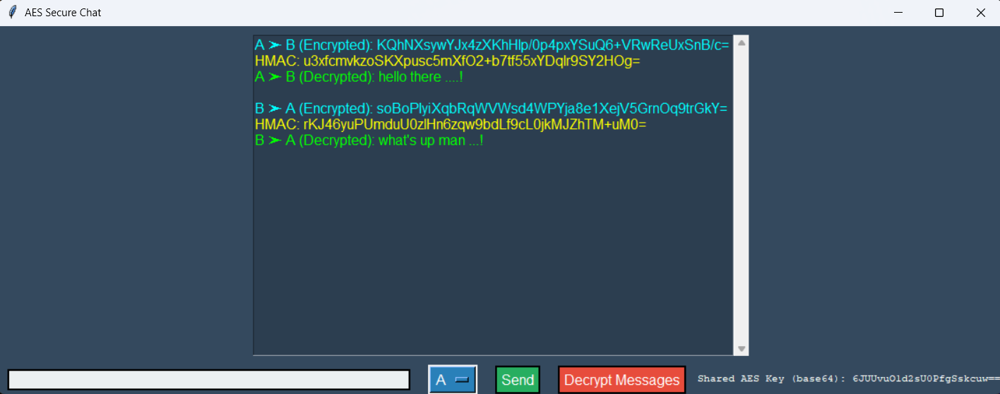

# 🔐 AES-RSA-CommSim

**A Secure Communication Simulator using AES Encryption and RSA Key Exchange**

> Simulate a real-time encrypted chat between two users with AES for fast symmetric encryption and RSA for secure key exchange. Ideal for students, enthusiasts, and anyone interested in understanding how hybrid encryption works in real-world messaging apps.

---

## 🚀 Features

- 🔑 **AES-128 Encryption** for secure message confidentiality  
- 🧾 **HMAC** for message integrity verification  
- 🔐 **RSA Encryption** for secure AES key sharing  
- 👥 **Two-user chat simulation** with encrypted + decrypted views  
- 🖥️ **Simple GUI (Tkinter)** for interactive chatting  
- 💬 **Switch between User A and User B** to view encrypted and decrypted messages

---

## 🛠️ How It Works

This project simulates secure chat using a **hybrid cryptography model**:

### 🧠 Step-by-step:
1. **RSA Key Generation**:  
   On app start, RSA public-private keys are generated.

2. **AES Key Creation**:  
   A random 128-bit AES key is generated for symmetric encryption.

3. **Key Exchange via RSA**:  
   AES key is encrypted with the RSA public key and then decrypted using the private key — mimicking a secure exchange.

4. **Message Encryption**:  
   Messages are encrypted with AES and verified using HMAC to ensure they haven’t been tampered with.

5. **User View Switching**:  
   The user can switch between A and B, seeing encrypted messages and decrypting them on demand.

---

## 📸 Preview

> Chat window with encrypted and decrypted views:



---

## 💾 Installation

### 🔧 Prerequisites:
- Python 3.7+
- Required libraries:
  ```bash
  pip install pycryptodome

🧪 Run the App:
bash
Copy
Edit
python chat_gui.py
🗃️ Project Structure
graphql
Copy
Edit
AES-RSA-CommSim/
├── aes_simulation.py         # AES + HMAC encryption/decryption
├── rsa_key_exchange.py       # RSA key generation and AES key exchange
├── chat_gui.py               # Main Tkinter GUI interface
├── README.md                 # Project documentation
└── requirements.txt          # Dependencies (optional)
✨ Educational Value
This simulation is a simplified model of how secure messaging apps like WhatsApp, Signal, or Telegram manage encrypted chats — combining:

Symmetric encryption (AES) for fast data encryption

Asymmetric encryption (RSA) for secure key exchange

HMAC to ensure data hasn’t been tampered with

Perfect for:

Cybersecurity students

Cryptography beginners

Python hobbyists

Demoing hybrid encryption

📜 License
MIT License — free to use, modify, and distribute.

🤝 Contributing
Got ideas? Want to add quantum encryption or better UI?
Feel free to fork the repo and open a pull request.

📬 Contact
Made with ❤️ 